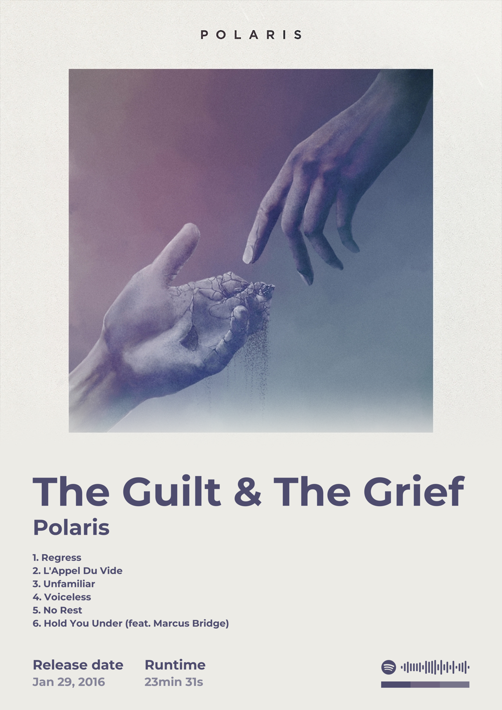
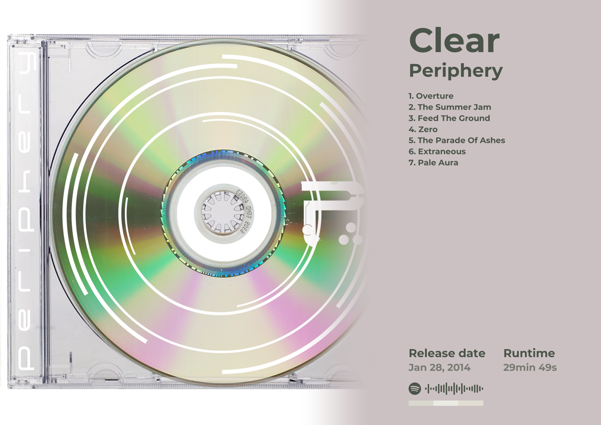

# Framefy

Makes a printable poster from a Spotify album, or one mosaic poster from several albums.

 

## Setup

    pip install pillow

## Use

    python framefy.py

This opens the UI in your browser: paste a Spotify album link, choose the options, download the poster. No Spotify API key is needed.

From the terminal instead:

    python framefy.py https://open.spotify.com/album/30TlXptEYPQHt9ozcEeqBt --size A3 --orientation landscape --format pdf

| Option | Values | Default |
| --- | --- | --- |
| `--size` | `A5`, `A4`, `A3`, `A2`, `LETTER`, `50X70` | `A4` |
| `--orientation` | `portrait`, `landscape` | `portrait` |
| `--format` | `png`, `pdf` | `png` |
| `--layout` | `standard`, `cover-right` (landscape), `minimal` (cover, title, artist only) | `standard` |
| `--cover` | `fade`, `soft`, `sharp`, `framed` | `fade` |
| `--cover-image` | your own image file instead of the album cover | album cover |
| `--bg`, `--text` | colour such as `#ecebe6` | from the cover |
| `--font` | `montserrat`, `playfair` | `montserrat` |
| `--weight` | `light`, `bold`, `black` | `bold` |
| `--hide` | comma-separated: `tracks`, `date`, `runtime`, `code`, `strip`, `artists` (mosaic) | nothing |
| `--artist-image` | flag: artist's profile picture next to their name | off |
| `--durations` | flag: each track's length | off |
| `--clean-titles` | flag: drops `(feat. …)` and remaster notes from track names | off |
| `--columns` | `1` to `4` tracklist columns | automatic |
| `--title`, `--artist` | replacement text | from Spotify |
| `--caption` | small line at the bottom | none |
| `--bleed` | `0` to `10` mm extra margin for print shops | `0` |
| `-o` | output file | `<artist> - <album>.<format>` |

## Several albums

Several links, in the UI box or on the command line, make one poster: a mosaic of the covers above the list of albums. `@albums.txt` reads one link per line.

    python framefy.py @albums.txt --title "Heavy rotation" --hide artists

## Jellyfin favourites

    python framefy.py --jellyfin

makes the same poster from your favourite albums in Jellyfin; the UI gets a button for it. Add the server to `.env`:

    JELLYFIN_URL=http://localhost:8096
    JELLYFIN_API_KEY=
    JELLYFIN_USER=

The API key comes from Dashboard → API Keys. `JELLYFIN_USER` is the user name; left empty, the first user is used.

## Searching by name (optional)

Searching albums by name, in the UI or with `python framefy.py "polaris the guilt and the grief"`, needs your Spotify API credentials. Copy the example file:

    cp .env.example .env

Open `.env` and add your client ID and client secret after the `=`:

    SPOTIFY_CLIENT_ID=
    SPOTIFY_CLIENT_SECRET=

`.env` is not tracked by git. Variables already exported in the shell take priority over the file.
